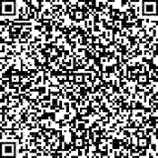
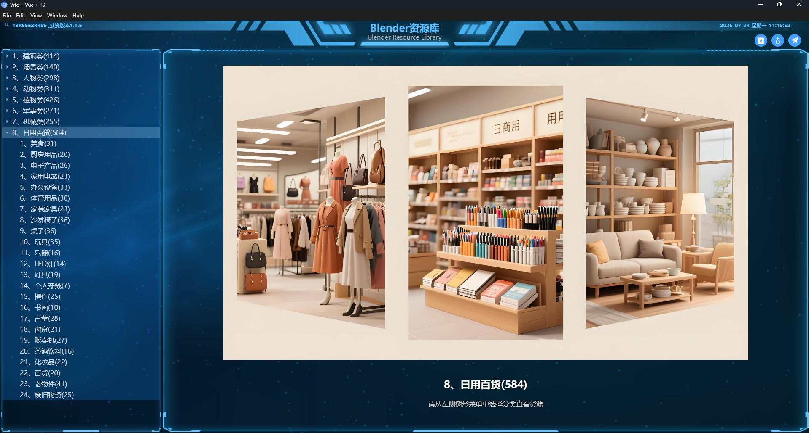
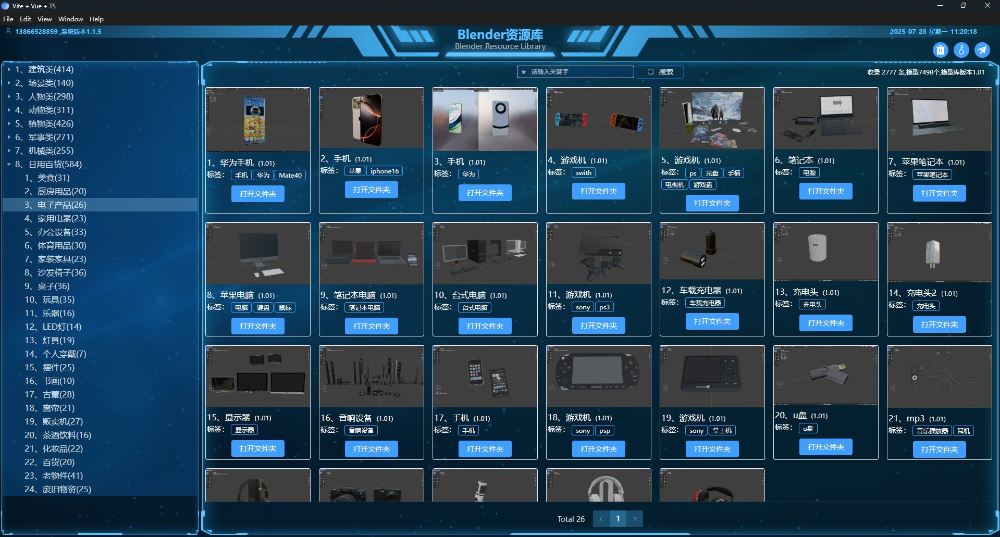
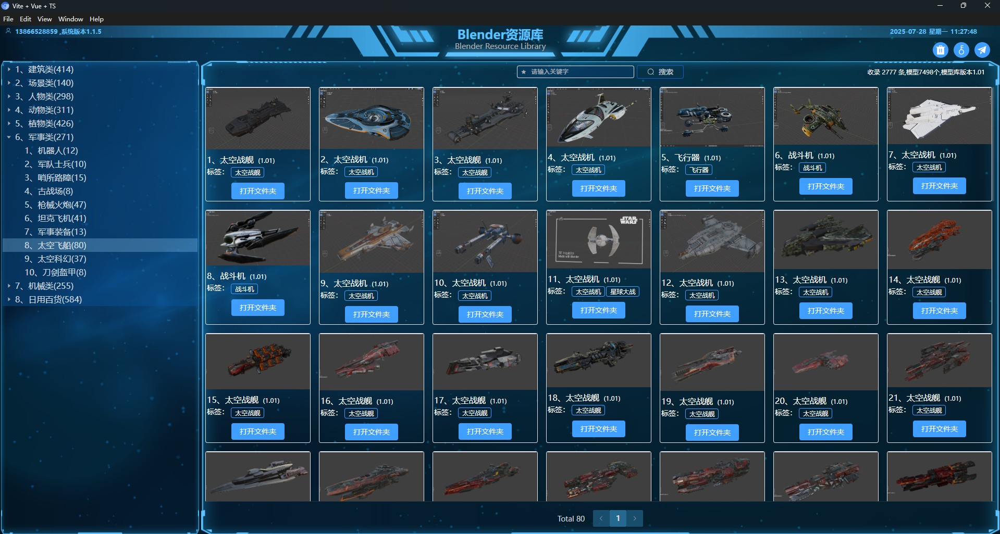
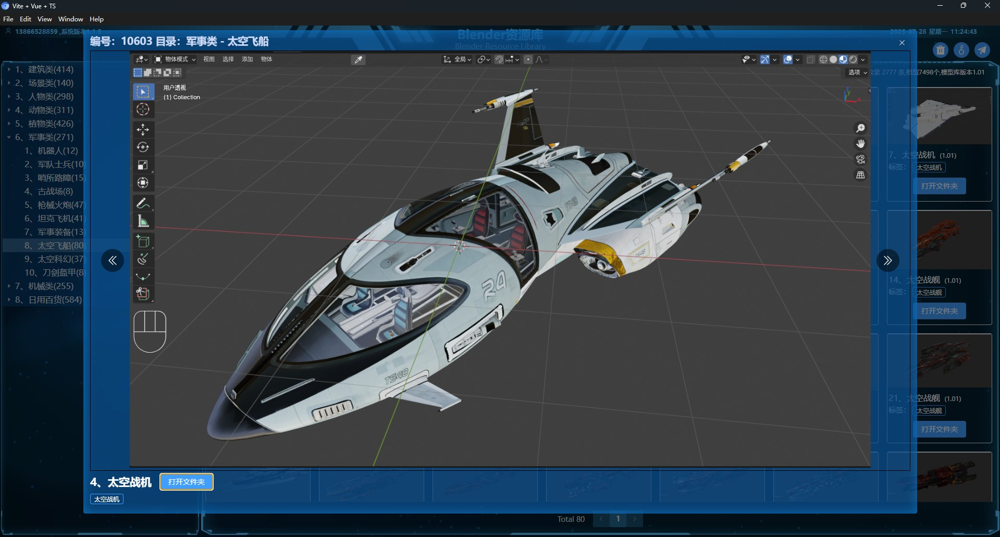
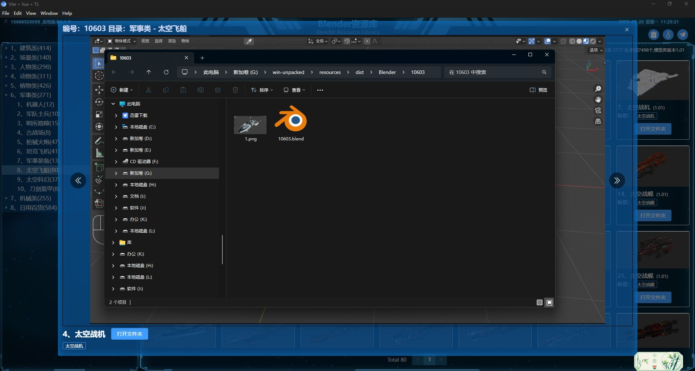
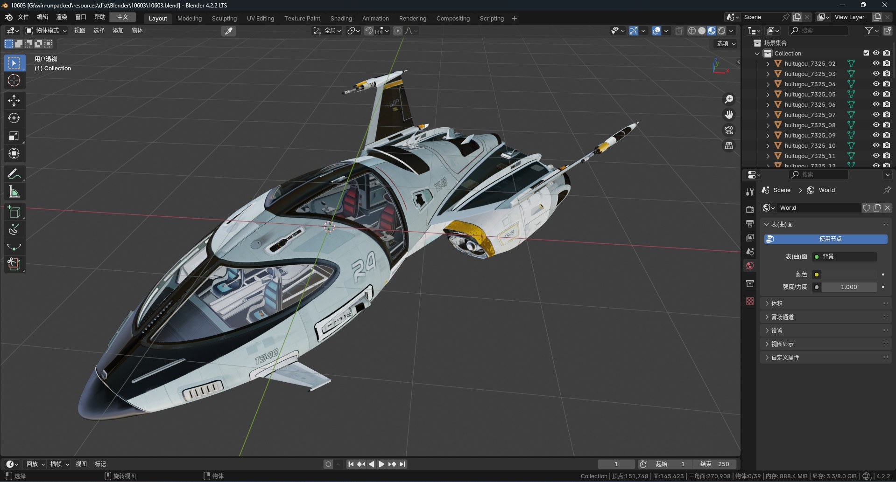

# 🎨 Blender 智能模型库 | 人物·建筑·场景·机械等 近万高精度模型  
### 亚洲人物模型  
在file/rw.7z中下载

### 🌟 **核心优势**  
✅ **智能检索**｜AI标签+3D预览，模糊搜索（如"中式别墅""原神角色"）秒定位  
✅ **私有化部署**｜几百G精选素材本地存储，版本可控，支持 **Win10/Win11**  
✅ **动态分类**｜模型库自动学习使用习惯，越用越顺手  

---

### 📦 **模型库内容（V1.2）**  
| **类别**       | **数量** | **热门子分类**  
|----------------|---------|-----------------  
| 🏗 **建筑类**  | 443     | 中式古典/现代别墅/高楼大厦/工厂车间  
| 🌄 **场景类**  | 159     | 山水地形/岩石/创意空间  
| 👥 **人物类**  | 401     | 美少女/原神/拳皇/骨骼动画  
| 🦁 **动物类**  | 312     | 怪物/宠物/昆虫/珊瑚  
| 🌿 **植物类**  | 436     | 树木/鲜花/多肉/蔬菜  
| ⚔️ **军事类**  | 325     | 太空飞船/坦克飞机/士兵动画  
| 🚗 **机械类**  | 296     | 工程机械/时尚汽车/医疗器械  

---

### 🆚 **传统 vs 智能管理**  
```diff
- 传统文件夹  
  "婴儿床.blender"藏在 [日用百货/玩具类/玩具汇总] 里  
  ⏳ 耗时：5分钟~永远  

+ 智能资料库  
  输入"婴儿床" → 自动匹配模型+预览图  
  ⏳ 耗时：3秒  
``` 

### 🎯 立即体验  
🔗 [在线素材库入口](http://www.zjzqrj.cn/#/resource)  
📌 **当前规模**：3000+标签｜8100+模型｜275G精选资源  

### 🎯 拼多多扫一扫  


### 🎯 图片预览







