# 🎨 Blender 模型库 | 人物·建筑·场景·机械等 近万高精度模型  


🔗 [体验版下载](https://wwtp.lanzoul.com/BlenderModel)  
https://wwtp.lanzoul.com/BlenderModel  
📌 **当前规模**：上万模型｜TB级精选资源｜ 支持百度、夸克、迅雷

### 🌟 **核心优势**  
✅ **系统化归档与智能检索：支持对近TB级的Blender素材，通过标签标注、缩略图预览等功能，实现快速、精准的智能搜索**  
✅ **本地部署与持续更新：确保.blend文件在本地安全存储，并支持定期更新，兼顾素材新鲜与使用稳定**  
✅ **清晰分类与智能整理：具备合理的目录结构，清晰的分类，让文件存放一目了然**  
✅ **按需加载，灵活存取：不必一次性下载所有素材，而是支持按需选择、随时调用，大幅节省本地存储空间**  
✅ **本地编辑，自由管理：支持在本地直接新增、修改，适应个性化需求**  
---

### 📦 **模型库内容（V1.2）**  
| **类别**       | **数量** | **热门子分类**  
|----------------|---------|-----------------  
| 🏗 **建筑类**  | 538     | 中式古典/现代别墅/高楼大厦/工厂车间  
| 🌄 **场景类**  | 650     | 山水地形/岩石/创意空间  
| 👥 **人物类**  | 1132     | 美少女/原神/拳皇/骨骼动画  
| 🦁 **动物类**  | 348     | 怪物/宠物/昆虫/珊瑚  
| 🌿 **植物类**  | 534     | 树木/鲜花/多肉/蔬菜  
| ⚔️ **军事类**  | 454     | 太空飞船/坦克飞机/士兵动画  
| 🚗 **机械类**  | 479     | 工程机械/时尚汽车/医疗器械  
| 🚗 **电子类**  | 310     | 电子产品/硬件芯片/办公设备  
| 🚗 **百货类**  | 611     | 美食/体育用品/个人穿戴  

---
### 🆚 **传统 vs 智能管理**  
```diff
+ 模型库 
     内置近TB级精选模型，分类清晰，支持智能搜索，万款模型，触手可及。

+ 本地库  
     轻松构建您的私人本地库，将常用素材和个人作品井井有条地归档，形成您的专属创意资产库。

+ 分享库  
     将杰作分享出去，交流学习，赚取积分。
```  


🔗 [联系QQ] 99635098

### 🎯 图片预览
模型库：
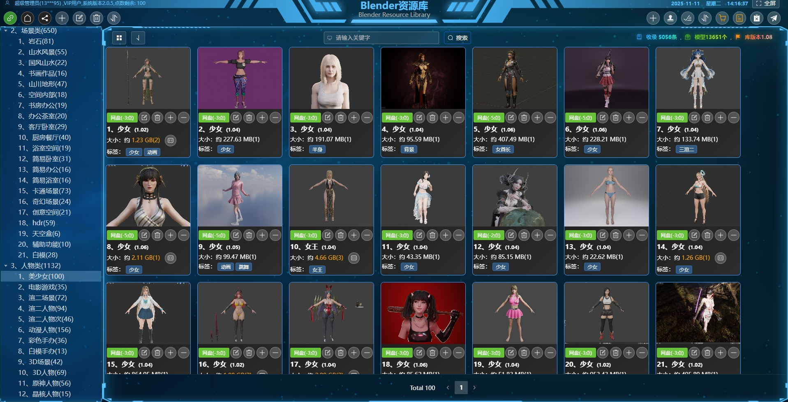
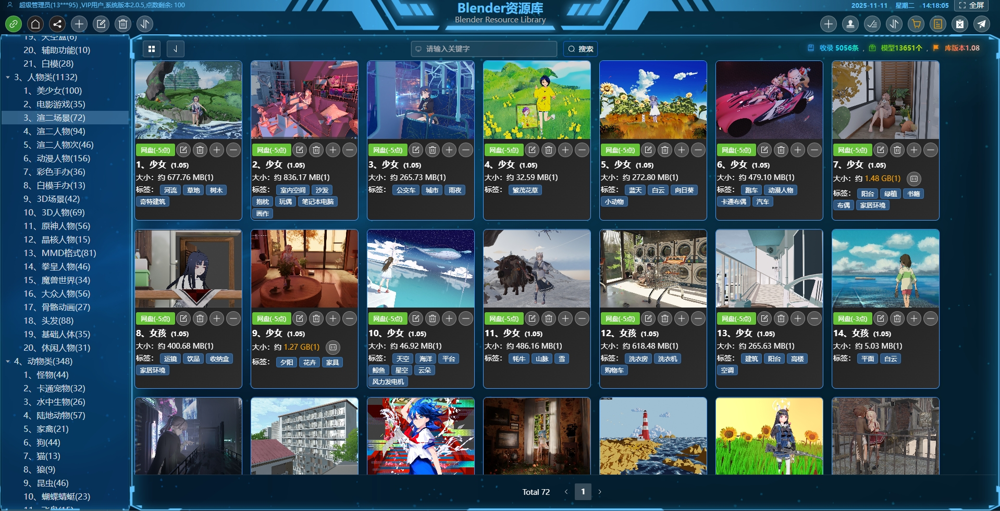
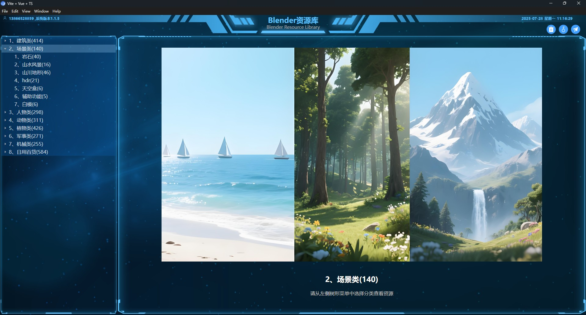 
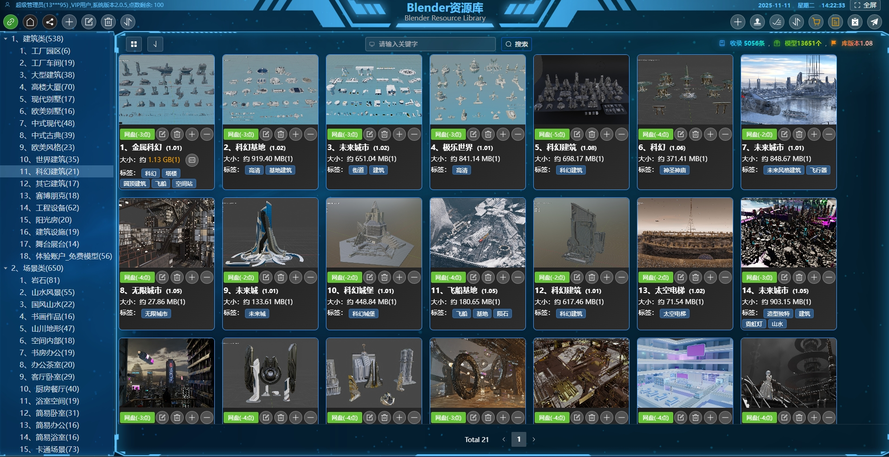
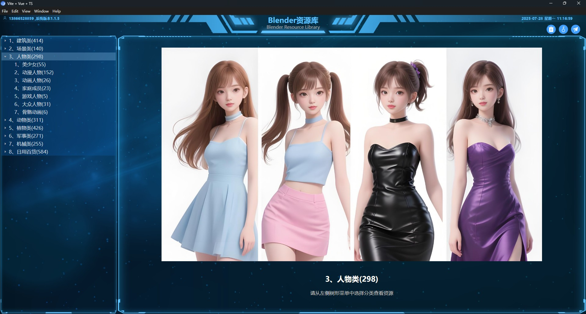
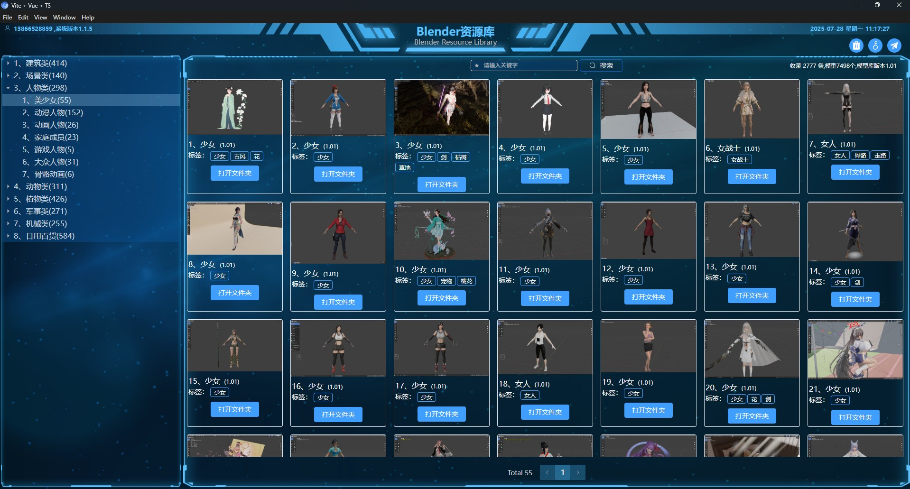
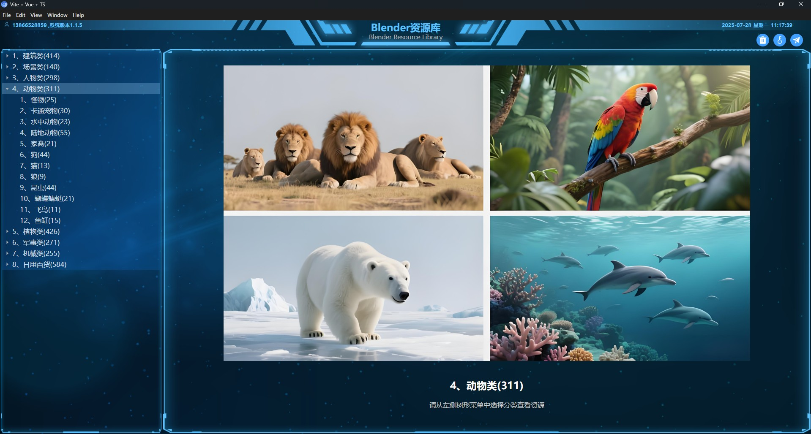
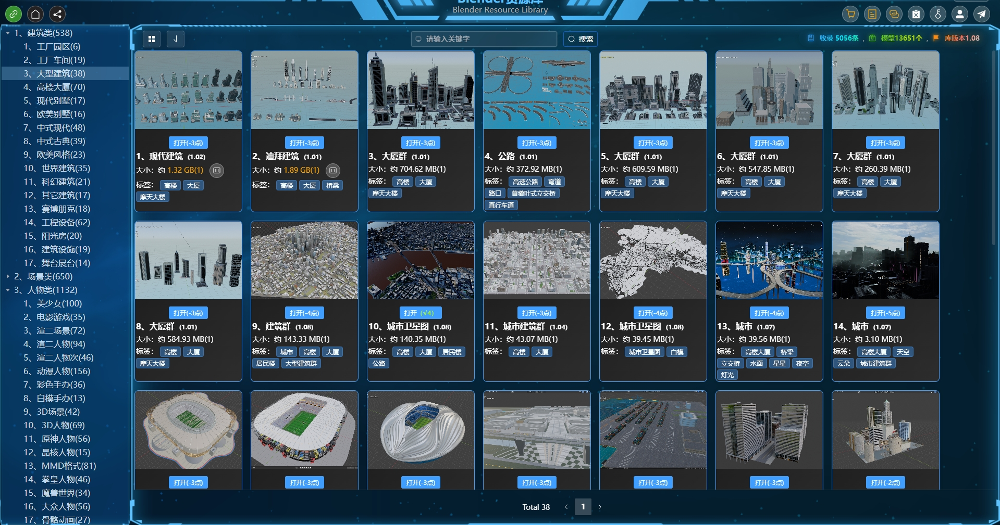

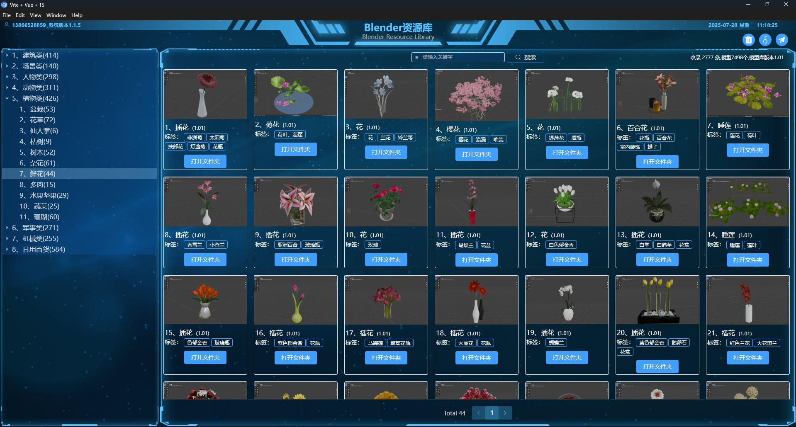
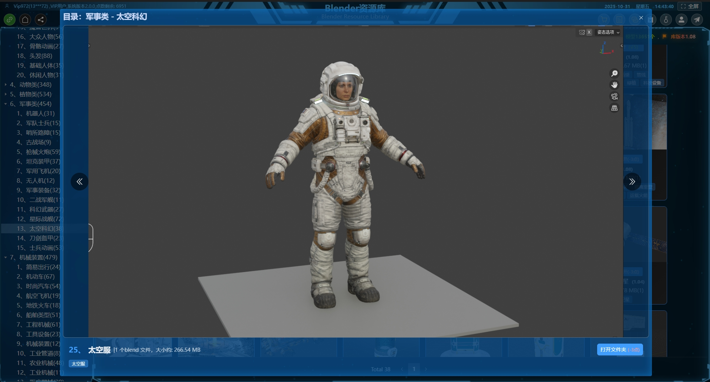
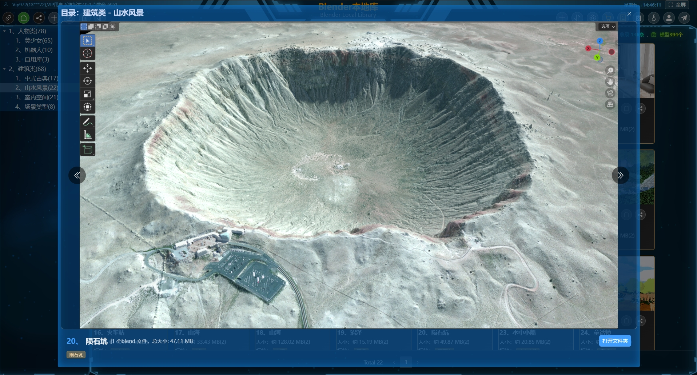
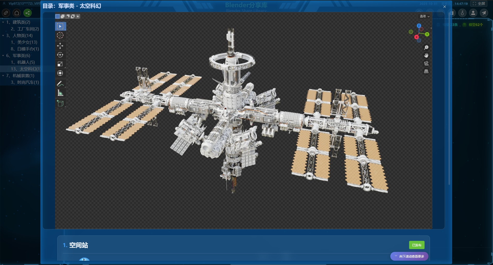
本地库：
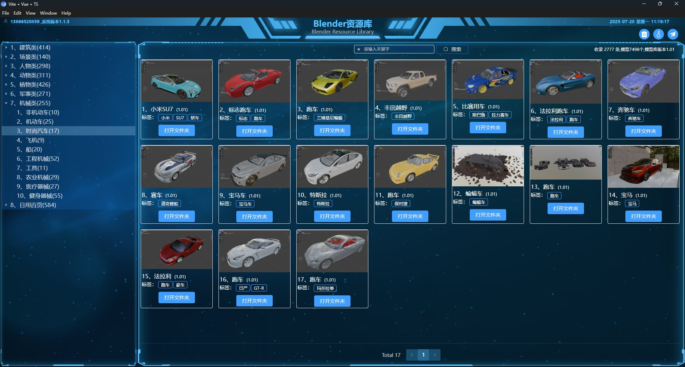
分享库：
